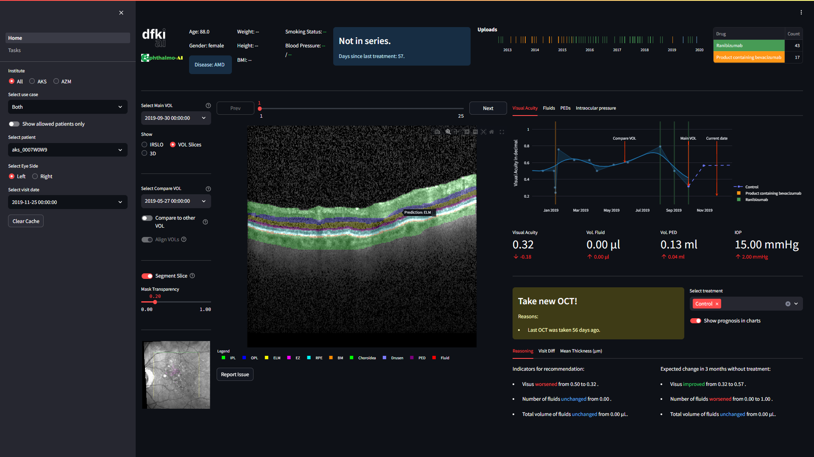

# Welcome to Ophthalmo-CDSS
This repository contains code for the Ophthalmo-CDSS, a web application that allows users to visualize and 
analyze data from the OphthalmoAI project. From the website of [OphthalmoAI](https://medicalcps.dfki.de/?page_id=1687):
> The goal of Ophthalmo-AI is to develop better diagnostic and therapeutic decision support in ophthalmology 
> through effective collaboration of machine and human expertise (Interactive Machine Learning – IML). 
> The DFKI aims to integrate clinical guidelines and knowledge of medical professionals 
> (expert knowledge/or human intelligence) interactively with machine learning (artificial intelligence) 
> into the diagnostic process in a so-called augmented intelligence system. In order to achieve this, 
> diagnostic ML models and explanatory components (e.g., visualization tools) are developed, which provide 
> physicians with feedback on the decisions of the ML model and thus make a decisive contribution to 
> transparency in the diagnosis and therapy process. In the future, this system will not only be used in 
> the diagnosis scenario, but also for low-threshold automatic support in the processing/annotation of OCT 
> image data.

The Ophthalmo-CDSS is a Clinical Decision Support System with a variety of functionality. It has been 
developed and evaluated in the form of a master thesis by Robert Andreas Leist (Email: robert.leist@dfki.de).

# License

<a property="dct:title" rel="cc:attributionURL" href="https://github.com/DFKI-Interactive-Machine-Learning/ophthalmo-cdss">Ophthalmo-CDSS</a> by <a rel="cc:attributionURL dct:creator" property="cc:attributionName" href="https://github.com/robertleist">Robert Andreas Leist</a> is licensed under <a href="https://creativecommons.org/licenses/by-nc-sa/4.0/?ref=chooser-v1" target="_blank" rel="license noopener noreferrer" style="display:inline-block;">CC BY-NC-SA 4.0</a>

# Installation and Usage
To install the Ophthalmo-CDSS, follow these steps:
1. Clone the repository
2. Install the required packages by running `pip install -r requirements.txt`
3. Run the application by running `python __main__.py` in the root directory of the repository.
4. A browser window should automatically open with the Ophthalmo-CDSS.
5. If not you can manually open the dashboard by navigating to http://localhost:8501/

> Note: The CDSS will not work properly without a valid dataset consisting of a sqlite database following the db scheme 
> of `./data/demo.sqlite` and OCT files in the VOL format. 
> The dataset is not included in the repository and cannot be made publicly available as it is part of the 
> OphthalmoAI project. For data security reasons the models (segmentation and forecasting) will not be published.
# Documentation
Each folder inside the dashboard contains its own Readme.md file with more detailed information about the folder. 
This document delivers an overview of the folders, their contained code and other files:
- `.streamlit/`: Contains a config file for the streamlit application.
- `data/`: Contains the data used by the dashboard. This includes the OCT images and the predictions made by the 
  OphthalmoAI model. Note: Data will not be published so the folder is empty.
- `icons/`: Contains the icons used by the dashboard.
- `src/`: Contains the source code for the backend of the dashboard. For more details see [backend documentation](src/Readme.md).
- `tests/`: Contains the tests for the dashboard. For more details see [test documentation](tests/Readme.md).
- `visual_components/`: Contains streamlit code for the visual components that make up the dashboard. 
  For more details see [VC documentation](visual_components/Readme.md).
- `__main__.py`: Main file to run the dashboard.
- `requirements.txt`: File containing the required packages for the dashboard.
- `config.py`: File containing the configuration for the dashboard.
- `Readme.md`: This file.
- `Home.py`: The main page of the dashboard, must be in the root directory.
